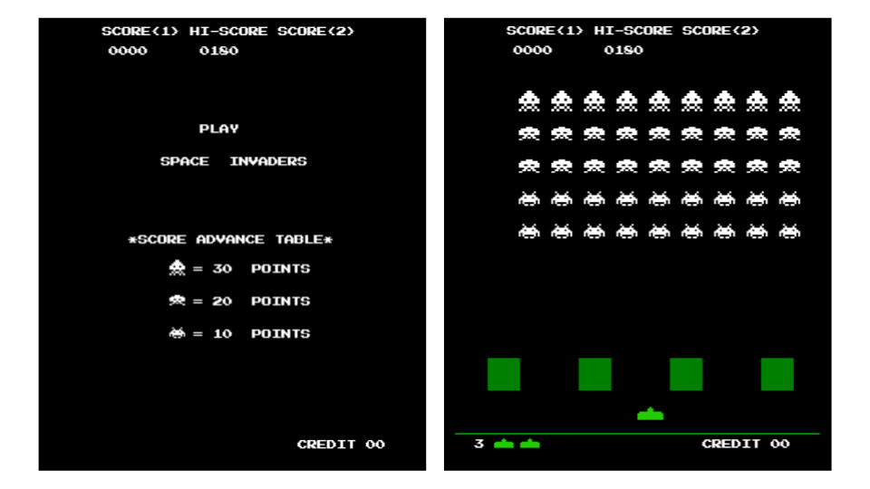

# 👾🕹️Space Invaders en JavaScript👾🕹️

¡Bienvenido/a al proyecto de Space Invaders en JavaScript! Este es un juego clásico recreado utilizando JavaScript, HTML y CSS.

## Descripción del Juego

Space Invaders es un juego arcade clásico lanzado en 1978. El jugador controla una nave espacial que puede moverse horizontalmente en la parte inferior de la pantalla y dispara a los invasores alienígenas que descienden desde la parte superior de la pantalla. El objetivo es eliminar todos los invasores antes de que lleguen a la parte inferior de la pantalla o antes de que la nave sea destruida.

## Características

- Movimiento horizontal de la nave espacial.
- Disparo de balas desde la nave espacial.
- Movimiento de los invasores alienígenas.
- Detección de colisiones entre balas y alienígenas.
- Puntuación que aumenta al eliminar invasores.
- Niveles de dificultad crecientes.

## Tecnologías Utilizadas

- HTML
- CSS
- JavaScript 

## Instalación y Uso

1. Clona este repositorio en tu máquina local.
    https://github.com/Barsino/Space-Invaders_Js.git

2. Abre el archivo `index.html` en tu navegador web.

3. ¡Disfruta del juego! Utiliza las teclas de flecha izquierda y derecha para mover la nave espacial y la barra espaciadora para disparar.

